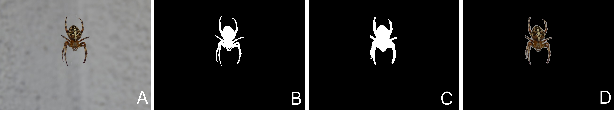
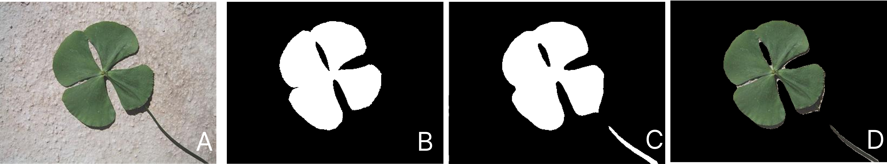
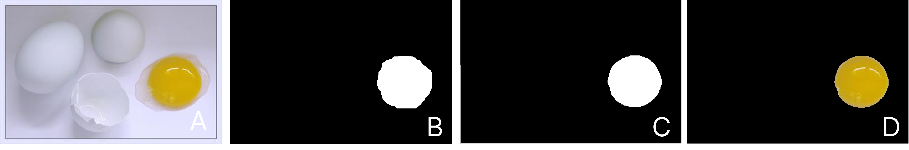
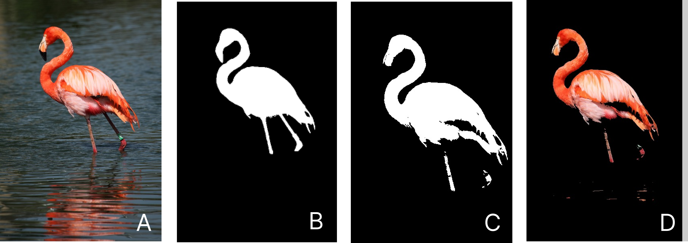
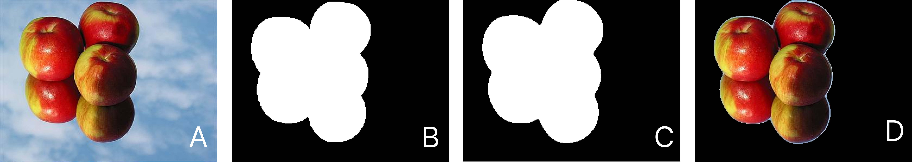

# Computação Gráfica e Processamento de Imagens 👀

> Trabalho de Segmentação de Imagens - 🤔

## 😎 Objetivo ## 

 O objetivo deste trabalho consiste em realizarmos a segmentação de diversos objetos diferentes com a maior fidelidade possível do banco de imagens, sendo próximo ao resultado do ground truth do banco de imagens.

## :rocket: Tecnologias ##

Neste projeto foram utilizadas as seguintes ferramentas:

- [Processing](https://processing.org/)  
- [Git](https://git-scm.com) 

## :closed_book: Requisitos ##

Antes de iniciar :checkered_flag:, você precisa ter o [Git](https://git-scm.com) / [VS Code](https://code.visualstudio.com/) ou  [Processing](https://processing.org/)   o  instalado

## :checkered_flag: Iniciando ##

##### existem duas maneiras uma pelo vs code e outra pelo processing

######visual studio code (Clone o projeto)
$ git clone https://github.com/Rafael-Yokoyama/Projeto-de-CGPI.git

 acesse o <a href=" https://www.youtube.com/watch?v=LKuu-WcOZYA ">vídeo  </a>  para configurar o processing no vs code
 

###### processing
- acesse e baixe o  <a href="https://processing.org/">Processing  </a> 

- baixe o zip
   
 
## 🖥️ Metodologias 

 Utilizando o conhecimento adquirido ao longo do curso, conseguimos aplicar alguns filtros nas imagens escolhidas para realizar a segmentação, filtros como: 

- escala de cinza
- limiarização
- filtro gaussiano
- filtros de média 
- filtro de janela deslizante

## 👽 Resultados

<table>
    </td>
       <td align="center">
       <b> --- Aranha ---</b>
      

         
        
          
 <b>Processo de segmentação da primeira imagem</b>(A) Imagem Original (B) Ground Truth obtido do banco de imagem (C) Ground Truth gerado e (D) Imagem Segmentada

        
      

    </td>
  </tr>
</table>

<table>
    </td>
       <td align="center">
       <b>--- Trevo ---</b>
      

         
        
          
 <b>Processo de segmentação da primeira imagem</b>(A) Imagem Original (B) Ground Truth obtido do banco de imagem (C) Ground Truth gerado e (D) Imagem Segmentada

        
      

    </td>
  </tr>
</table>

<table>
    </td>
       <td align="center">
       <b>--- Ovo ---</b>
      

         
        
          
 <b>Processo de segmentação da primeira imagem</b>(A) Imagem Original (B) Ground Truth obtido do banco de imagem (C) Ground Truth gerado e (D) Imagem Segmentada

        
      

    </td>
  </tr>
</table>

<table>
    </td>
       <td align="center">
       <b>--- Flamingo ---</b>
      

         
        
          
 <b>Processo de segmentação da primeira imagem</b>(A) Imagem Original (B) Ground Truth obtido do banco de imagem (C) Ground Truth gerado e (D) Imagem Segmentada

        
      

    </td>
  </tr>
</table>

<table>
    </td>
       <td align="center">
     <b> --- Maça ---</b>
      

         
        
          
 <b>Processo de segmentação da primeira imagem</b>(A) Imagem Original (B) Ground Truth obtido do banco de imagem (C) Ground Truth gerado e (D) Imagem Segmentada

        
      

    </td>
  </tr>
</table>

- banco de images 
http://vision.ime.usp.br/~lucyacm/thesis/coift.html
http://mftp.mmcheng.net/Data/MSRA10K_Imgs_GT.zip
 
## 🤖 Conclusão 

No desenvolvimento deste trabalho os resultados  foram gerados a partir de dois bancos de imagens que tem uma base de aproximadamente 140 amostras que não seguem um padrão , tendo até alguns casos onde as imagens tem alguns ângulos bem diferentes e alguns com luminosidade ruim .

O foco deste trabalho consistiu no desenvolvimento de técnicas de segmentação e filtros robustos e reutilizáveis em diferentes tipos de imagens .

O presente processo de fazer a segmentação e todos os pontos deste trabalho forneceu uma visão  melhor da área  de Computação Gráfica e  Processamento de imagens, tendo como um dos objetivo despertar o interesse no grupo pela área. Outro objetivo foi compreender que a computação gráfica não está  presente apenas em jogos digitais , mas também em todas as aplicações do nosso dia a dia .

## 🤝 Contribuidoras

Agradecemos às seguintes pessoas que contribuíram para este projeto:

<table>
  <tr>
    <td align="center">
      <a href="#">
         
        
          <b>Rafael Yokoyama</b>
        
      </a>
    </td>
      <td align="center">
      <a href="#">
         
        
          <b>Luis Bianchine</b>
        
      </a>
    </td>
       <td align="center">
      <a href="#">
         
        
          <b>Guilherme Vale</b>
        
      </a>
    </td>
       <td align="center">
      <a href="#">
         
        
          <b>João Xavier</b>
        
      </a>
    </td>
  </tr>
</table>

## 📝 Licença

Este projeto está sob licença. Consulte o arquivo [LICENSE](LICENSE) para obter mais detalhes.

&#xa0;

<a href="#top">Back to top</a>
  </tr>
</table>
